## <b>R Mini Course</b>

### Course developed by <a href = "http://mccannecology.weebly.com/">Mike McCann</a> (2015) and <a href = "http://benweinstein.weebly.com/">Ben Weinstein</a> (2014)

#### <i>Nicole Kinlock</i>

##### January 19th and 20th, 2017

--- .seventy

## Directory

- Part 1: <a href = "#/2"> Basics of R </a>
- Part 2: <a href = "#/43"> Probability </a>
- Part 3: <a href = "#/62"> Data manipulation </a>
- Part 4: <a href = "#/95"> Looping and vectorization </a>
- Part 5: <a href = "#/131"> Functions </a>
- Part 6: <a href = "#/146"> Data visualization using ggplot2 </a>

---

## <b>Part 1:</b> Basics of R

##### <a href = "#/1">Back to the directory</a>

--- ds:noborder

## Introduction to R

- Statistical programming language and environment
- Available as public domain software <i>(i.e. not copyrighted)</i>
- Free!
- Better than most commercial alternatives
- Available on all platforms <i>(Windows, OSX, Linux)</i>
- Not just for statistics, but also general purpose programming


--- ds:noborder

## Why use R?

- Flexible
- Transparent
- Large user base
- Valued skill <i>(Remember, R is a programming <b>language</b>)</i>

--- ds:noborder

## RStudio

- Integrated development environment (IDE) for the R language
- AKA use R with a nice, shiny interface
- Also free!
- Using R without RStudio feels kind of like using only Command (Windows) or Terminal (Mac) on your computer 


--- ds:noborder

## Running R with RStudio

- The screen is split four ways: 
  - <b>Workspace:</b> (Top left) Where scripts are written & saved
  - <b>Console:</b> (Bottom left) Where commands are run
  - <b>Environment, History:</b> (Top right) Where objects are stored
  - <b>Files, Plots, Packages, and Help:</b> (Bottom right) View data, help 

---

## Running R with RStudio

- Type directly into the console (best when you don't want to save the code) or type into the script - then type `(CTRL + ENTER)` (Windows) or `(CMD + ENTER)` (Mac)

- A <b>script</b> is a plain text file with R commands in it. This will be where you save the code that you are writing - the file will end in the extension <b>.R</b>

--- ds:ninety

## R as a calculator 

- R has many <b>arithmetic</b> operators 
  - `+`  Addition 
  - `-`  Subtraction 
  - `*`  Multiplication 
  - `/`  Division 
  - `^`  Exponentiation 
  - `%%` Modulus (finds remainder) 
  - `%/%` Integer division (leaves off remainder)

- R obeys the standard order of operations

---

## R as a calculator

Examples


```r
7 + 4
```

```
## [1] 11
```

```r
3^2
```

```
## [1] 9
```

```r
10 %% 7
```

```
## [1] 3
```

--- .seventy

## R is logical 

- R also has many <b>logical</b> operators 
  - `<`  Less than
  - `<=` Less than or equal to 
  - `>`  Greater than
  - `>=` Greater than or equal to  
  - `==` Exactly equal to 
  - `!=` Not equal to 
  - `!`  NOT
  - `|`  OR
  - `&`  AND

---

## R is logical 

Examples


```r
7 == 4
```

```
## [1] FALSE
```

```r
3 > 2
```

```
## [1] TRUE
```

```r
7 != 4
```

```
## [1] TRUE
```

--- ds:soothe

## Try It!

1. What is 21 multiplied by 342?

2. What is 15 to the fourth power?

3. Is 8 to the fifth power equal to the sum of 692 and 7500 multiplied by 4?

---

## Creating Objects

- An <b>object</b> is the fundamental unit in R. All expressions can be saved as an object.

- To create an object from an expression we use the <b>assignment operator</b> (`<-`). The assignment operator assigns values on the right to objects on the left.


```r
a <- (12 + 180) * 3
a
```

```
## [1] 576
```

- The object `a` is now the output of the expression `(12 + 180) * 3`. Check your <b>environment</b> (upper right panel)

---

## Assignment operator

- Do not use <b>`a = 12 + 180`</b> for assignment in R. It's best practice to use `<-` intead of `=`.

- This may seem arbitrary, but it is helpful when you are reading someone else's code.

<a href = "https://google.github.io/styleguide/Rguide.xml" target = "_blank"> Google's R Style Guide  </a>

<a href = "http://adv-r.had.co.nz/Style.html" target = "_blank"> Advanced R: Style Guide </a>

--- ds:alert

## R Tip: Comment on your code 

<b>Use `#` signs to comment on your script.</b> Anything to the right of a `#` is ignored. Good scripts (and homework) have comments before every major block of code. It's surprisingly hard to remember what you did when reviewing older code without comments, and it's particularly important when other people are reading your code.  


```r
5 + 5  # this adds five and five 
```

```
## [1] 10
```

```r
# 10 + 10 this does not add ten and ten 
```

---

## Expressions using objects

- Objects can be combined into other, larger, and more complex objects.


```r
a <- 8 * 10
b <- 2 * 10
d <- a * b
d
```

```
## [1] 1600
```

```r
# This is equivalent to: 
d <- 8 * 10 * 2 * 10
d
```

```
## [1] 1600
```

--- ds:soothe

## Try It!

1. Create an object that is equal to your age. Create another object that is equal to the age of the person to your right. Find the difference between these objects. 

---

### Data structures: 1. Vectors

- R has <b>five</b> common data structures. We will start with the simplest: <b>vectors</b>.  
- Vectors are one dimensional strings of numbers or characters. Vectors come in four types: numeric, integer, logical (TRUE or FALSE), and character. A vector is made using the combine function, `c()`.

---

### Data structures: 1. Vectors

#### Combining integers and numbers into vectors


```r
a <- c(3, 4, 5)
a
```

```
## [1] 3 4 5
```

```r
b <- c(3.24, 4.57, 5.03)
b
```

```
## [1] 3.24 4.57 5.03
```

---

### Data structures: 1. Vectors

#### Combining characters into vectors

- Characters in R need to be enclosed in quotation marks.


```r
pets <- c("dog", "cat", "bird")
pets
```

```
## [1] "dog"  "cat"  "bird"
```

---

### Data structures: 1. Vectors

#### Combining multiple objects into a single, new vector


```r
# Make objects 
a <- sqrt(4 * 7)
b <- 6 * 5
g <- 9 * 2

# Combine
d <- c(a, b, g)
d
```

```
## [1]  5.291503 30.000000 18.000000
```

---

### Data structures: 1. Vectors

#### Vectors of regular sequences

- You can use a colon (<b>:</b>) to create a vector that includes all integers in between the numbers on either side of the colon


```r
x <- 1:10
x
```

```
##  [1]  1  2  3  4  5  6  7  8  9 10
```

- You can use `seq(from = , to = , by = )` to create a vector with a set min and max (from, to) with a specified increment (by)


```r
x <- seq(from = 1, to = 20, by = 2)
x
```

```
##  [1]  1  3  5  7  9 11 13 15 17 19
```

--- ds:soothe

## Try It!

1. Create a vector that includes all integers between 5 and 25. Name this vector `x`.
2. Create a vector that includes all even integers between 2 and 22. Name this vector `y`.
3. Create a single vector that <b>combines</b> object x and object y. Name this vector `z`.

---

### Data structures: 1. Vectors

#### Vector indexing: positional

- You can access any element in the vector by putting its position in square brackets `[ ]`


```r
# create a vector 
height <- c(76, 72, 74, 74, 78)
height
```

```
## [1] 76 72 74 74 78
```

```r
height[1]  # extract the 1st element in the vector 
```

```
## [1] 76
```

```r
height[5]  # extract the 5th element
```

```
## [1] 78
```

---

### Data structures: 1. Vectors

#### Vector indexing: positional

- You can also use vector indexing to return the same vector with certain elements missing using the - symbol


```r
height <- c(76, 72, 74, 74, 78)

height[-1]
```

```
## [1] 72 74 74 78
```

---

### Data structures: 1. Vectors

#### Vector indexing: named

- You can assign names to each element of the vector, and then extract the element by indexing based on the name.


```r
# Create a vector with named elements 
temp <- c(monday = 28.1, tuesday = 28.5, wednesday = 29.0, thursday = 30.1, friday = 30.2)
temp
```

```
##    monday   tuesday wednesday  thursday    friday 
##      28.1      28.5      29.0      30.1      30.2
```

```r
temp["wednesday"]
```

```
## wednesday 
##        29
```

```r
temp[3]
```

```
## wednesday 
##        29
```

---

### Data structures: 1. Vectors

#### Vector indexing: logical

- You can extract elements in a vector that meet specific criteria based on a logical expression.


```r
y <- 5:50
y
```

```
##  [1]  5  6  7  8  9 10 11 12 13 14 15 16 17 18 19 20 21 22 23 24 25 26 27
## [24] 28 29 30 31 32 33 34 35 36 37 38 39 40 41 42 43 44 45 46 47 48 49 50
```

```r
y[y <= 10]   # extract all elements less than or equal to 10
```

```
## [1]  5  6  7  8  9 10
```

```r
y[y < 10 & y != 5]   # extract all elements less than 10 that are not equal to 5
```

```
## [1] 6 7 8 9
```

--- ds:soothe

## Try It!

1. What are the 9th and 12th positions of the vector `seq(1, 27, 0.5)`? 

2. <b>Bonus!</b> Can you find those positions simultaneously?

3. Create the vector `c(5:40)` and name it `m`. Extract all elements of `m` that are greater than or equal to 22.

---

## Functions

- A <b>function</b> is a stored object that performs a task given some inputs (called <i>arguments</i>). R has many functions already available, but you can also write your own functions.

- Try using the tab key while entering arguments in any function to discover a useful feature of RStudio. (Try now with the `seq()` function.)

- Functions are called in the format: `NameOfFunction(inputs)`   

- The output of a function can be saved to an object: `output <- NameOfFunction(inputs)`

---

## Functions

- It's not necessary to explicitly name arguments, but it's helpful when learning the language.


```r
seq(1, 10, 1)
```

```
##  [1]  1  2  3  4  5  6  7  8  9 10
```

```r
seq(from = 1, to = 10, by = 1)
```

```
##  [1]  1  2  3  4  5  6  7  8  9 10
```

---

## Functions

- Use `sum()` to take the sum of all elements in a vector:


```r
sum(c(3, 4, 5))
```

```
## [1] 12
```

- Use `mean()` to take the mean of all elements in a vector:


```r
mean(seq(5, 100, 5))
```

```
## [1] 52.5
```

---

## Functions

- Functions can act on an object


```r
x <- seq(5, 100, 5)

# use the vector x as the input to the function
mean(x)
```

```
## [1] 52.5
```

--- ds:alert

## R Tip: The help system

- Help files provide important information on what the function does, how it works, and they provide examples at the very bottom.


```r
help(mean)
```

- You can also use `?` before a function name to view the help file 


```r
?mean   # Same as help(mean) 
```

- Use `??` to search for functions; e.g. search for any function whose help files contain the word `"robust"`


```r
??robust
```

--- ds:soothe

## Try It!

1. What is the median of 26, 24, 8, 17, and 42?   
<i>Remember:</i> functions are often named intuitively.

2. What does the function `range()` do, and what is the sample example in the help file?

3. Is `mean(4, 5)` different than `mean(c(4, 5))`?

---

## Packages

- We will be exploring <b>functions</b> in much greater detail throughout this course. (Including writing your own functions!)

- Functions are kept inside <b>packages</b>, some of which come pre-installed with R. Others must be downloaded.

---

## Packages

- There are many, many R packages - currently 7742!

- Check the <a href = "http://cran.r-project.org/web/packages/available_packages_by_name.html" target = "_blank"> List of R Packages</a> and search with your favorite keyword, e.g. <i>ecology, paleo, dispersal, population, time series, phylogeny, community, Bayes</i>

---

## Installing Packages

- Often you will need to install a package to access a certain library of functions.


```r
# Install a new package
install.packages("igraph") 
```

- Remember to surround the package name in quotation marks for the `install.packages()` function.

---

## Loading Packages 

- Installing a package downloads it to your computer. You need to download packages before loading them.

- Additionally, you have to load packages before you use them every time you restart R. This lets R know what packages to load and not waste memory by loading all potential functions.    


```r
# two ways to load packages:
library(ggplot2)
require(ggplot2)
```

- <b>Note:</b> no quotation marks are needed for `library()` or `require()`

--- ds:alert

## R Tip: Loading Packages 

- Good scripts (and homeworks) have a series of `require()` or `library()` statements at the top of the script.

- <a href = "http://yihui.name/en/2014/07/library-vs-require/">Some say</a> that you should preferentially use `library()`. The logic behind this is because `require()` "tries" to laod a package and `library()` actually loads a package. If you use `require()` at the top of the screen and you don't have the package installed, you'll get a failure message later on when you use functions in the package. However, if you use `library()` at the top of the screen and you don't have the package installed, you'll get a failure message right away.

--- ds:soothe

## Try It!

1. Search and find an interesting package. What is it? What is one function included in the package?

2. Install the package to your computer. 

<a href = "http://cran.r-project.org/web/packages/available_packages_by_name.html" target = "_blank"> List of R Packages</a>

---

## The R User Community

<a href = "http://stackoverflow.com/questions/tagged/r" target = "_blank">Stack Overflow</a> 

<a href = "http://www.r-bloggers.com/" target = "_blank">R-Bloggers</a> 

<a href = "http://www.r-project.org/mail.html" target = "_blank">R Mailing Lists</a>

---

## Practice

Worksheets created by Mike McCann and hosted on his Rpubs site

<a href = "https://rpubs.com/mccannecology/53351" target = "_blank">Worksheet</a>

<a href = "https://rpubs.com/mccannecology/53358" target = "_blank">Answers</a>

---

## <b>Part 2:</b> Probability & Distributions

##### <a href = "#/1">Back to the directory</a>

--- ds:blackout

## Review

1. What is the (sum of 1 through 10) multiplied by two? 

2. What are the 12th and 45th positions of the vector `seq(1, 43, 0.25)`?

3. Find all of the elements of the vector `seq(1, 10, 0.1)` that are less than 2. What is the median value of these elements?


--- ds:noborder

## Distributions

- It is often  useful to generate a sample from a specific statisical distribution. To generate a sample of 1000 elements from a standard normal distribution (mean 0 and standard deviation 1) we can use the <b>`rnorm()`</b> function. 


```r
norm <- rnorm(n = 1000, mean = 0, sd = 1)  # create a vector of samples from a standard normal dist.
head(norm)  # view the first six elements of the vector
```

```
## [1]  0.76000848 -0.37924614  0.06295452  1.64946492  1.29218106  0.06953762
```

```r
hist(norm, col = "palevioletred", main = "", xlab = "", ylab = "Frequency")  # plot the vector of samples as a histogram
```


--- ds:soothe

## Try It!

1. Look up the `rnorm()` function in help screen. Locate the three arguments we used.

2. Draw 100 random numbers from a normal distribution with a mean of 3 and a std. dev. of 2, assign it to an object `a`.

3. Find the mean of your sample. How close was it to the true mean (that you set in `rnorm()`?

4. What is the 13th element in your vector `a`?

---

### Generating random samples from other distributions

- R has many distributions in the base package, including all those commonly used in biological analyses.  
- Depending on the distribution, each function has its own set of parameter arguments. 
- For example, the <b>`rpois()`</b> function is the random number generator for the Poisson distribution and it has only the parameter <i>lambda</i> ($\lambda$).
- Statistical distributions will be covered in much more detail in Biometry.

--- ds:soothe

## Try It!

1. Draw 100 random samples from a Poisson distribution with `lambda = 3`, assign it to an object `w`.

2. Draw 1000 random samples from a Poisson distribution with `lambda = 3`, assign it to an object `y`.

3. Calculate the means of both vectors. What is the difference in means?

---

## Other properties of distributions 

- For each distribution, there are <u>four functions</u> which will generate fundamental quantities of a distribution. Let's consider the normal distribution as an example. 
  - <b>`rnorm()`</b> a random sample from a normal distribution.  
  - <b>`dnorm()`</b> the probability density (or densities) for a specific value (or values) for a normal distribution.   
  - <b>`pnorm()`</b> the cumulative distribution function (area under the curve)  
  - <b>`qnorm()`</b> the quantile function (value x at which the CDF of the distribution is equal to p)   

- All will be covered during Biometry. See <a href = "http://user.mendelu.cz/drapela/Forest_Biometry/Lecture%20notes/R%20-%20tutorials%20and%20commands/R%20Probability%20Functions.pdf" target = _blank">this</a> website for a bit more information.

--- .eighty ds:noborder

## Univariate plots

### Barplots

- Barplots are a basic type of univariate plot. The R function to create a barplot is `barplot()`.


```r
# use the R dataset of the length of rivers in the United States (a univariate data set)
head(rivers)
```

```
## [1] 735 320 325 392 524 450
```

```r
barplot(height = rivers[1:10], col = "paleturquoise", main = "Lengths of rivers in the United States", ylab = "Length (in miles)")
```

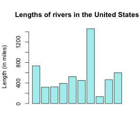

---

##  Univariate plots

### Histograms

- Histograms are also a common univariate plot. Histograms place data into "bins", and count the number (frequency) of data falling into each bin. 

- Bins are usually plotted as bars, with the x range on the x axis, and frequency on the y axis.

---

##  Univariate plots

### Histograms

Histograms are an effective way of visualizing distributions


```r
# generate and visualize 100 random samples from a standard normal distribution
sample <- rnorm(1000)
hist(sample, col = "palevioletred", main = "", xlab = "", ylab = "Frequency")
```


--- ds:soothe .ninety

## Try It!

1. Draw 10 random variates from a normal distribution and plot a histogram of the sample. Repeat for 100, then 1000 random variates. What do you notice about the histograms?

2. Explore at least one other distribution; look up `?distributions`.

3. Take a random sample of the new distribution, plot the sample, and share with your neighbor.

4. Draw 1000 random variates from a normal distribution with a mean of 0 and a sd of 1. Look at `?hist`. How do you specify the size of the bin range? Try making bins from -4 to 4, with intervals of 0.01, 0.1, and 1. <b>Hint:</b> Consider using `seq()` in the "breaks" argument within `hist()`.

---

## Sampling

- In R, it's very easy to take a random sample of elements in any vector with the `sample()` function. 

- Take a random sample of 20 elements from a vector of integers between 1 and 100.


```r
x <- 1:100
sample(x, size = 20)  # sample without replacement
```

```
##  [1] 97 18 41 92 46 27 55 36 89 37 90 44 76 14 29 39 21 20 74 98
```

```r
sample(x, size = 20, replace = TRUE)  # sample with replacement
```

```
##  [1]  6 84 69 90 13 10 33  7 25 39 15 62 24 22 36 68 64 46 49 35
```

--- ds:soothe

## Try It!

1. Sample 9 elements from a vector of integers between 125 and 325 without replacement.

2. Sample 5 letters (using the pre-installed vector `letters`) from the alphabet with replacement.

3. Sample 0 or 1 twelve times, with and without replacement. What happens?

--- ds:noborder

## Bivariate plots
### Scatterplots

- Scatterplots are useful for showing the relationship between two variables 
 

```r
sample1 <- rnorm(n = 40, mean = 4, sd = 2)  # random sample from a normal dist.
sample2 <- rnorm(n = 40, mean = 2, sd = 1)  # random sample from a different normal dist.
plot(formula = sample2 ~ sample1, pch = 20)
```

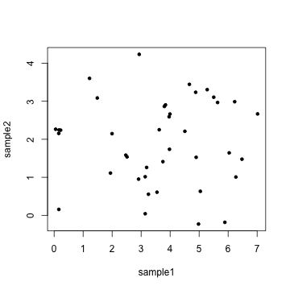

--- ds:noborder

## Bivariate plots
### Scatterplots

- Instead of writing the relationship as a formula, i.e. `y ~ x`, you can write `plot(x, y)`.


```r
plot(x = sample1, y = sample2, pch = 20)
```

 

--- ds:noborder

## Bivariate plots
### Scatterplots

- You can add straight lines to a plot with `abline()`. <b>a</b> specifies the intercept and <b>b</b> the slope.


```r
plot(sample1, sample2, pch = 20)
abline(a = -0.1, b = 1, col="royalblue4")
```


--- ds:noborder

## Bivariate plots
### Scatterplots

- Lines can also be model fits 

- `lm()` fits a linear relationship between <b>x</b> and <b>y</b>.


```r
plot(sample1, sample2)
abline(lm(sample2 ~ sample1), col="royalblue")
```

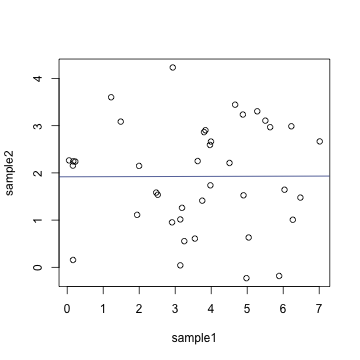

---

## Lots of useful links for plotting 

<a href = "http://rpubs.com/SusanEJohnston/7953" target = "_blank">R Base Graphics: An Idiot's Guide</a>

<a href = "https://leemendelowitz.github.io/blog/r-base-graphics-plotting.html" target = "_blank">R Base Graphics Plotting</a>

<a href = "http://www.statmethods.net/graphs/" target = "_blank">Quick-R: Basic Graphs</a>

<a href = "http://www.harding.edu/fmccown/r/" target = "_blank">Producing Simple Graphs with R</a>

<a href = "http://www.stat.columbia.edu/~tzheng/files/Rcolor.pdf" target = "_blank">R Colors</a>

More on plotting later (making plots that are much more visually appealing!)

---

## Practice

<a href = "https://rpubs.com/mccannecology/53352" target = "_blank">Worksheet</a>

<a href = "https://rpubs.com/mccannecology/53359" target = "_blank">Answers</a>

---

## <b>Part 3:</b> Data Manipulation

##### <a href = "#/1">Back to the directory</a>

---

Download the file for this section

<a href = "https://www.dropbox.com/s/qk11hhsipddk3fk/seedlings.csv?dl=0" target = "_blank">seedlings.csv</a>

---

### Data structures: 2. Data frames

- Most data you've worked with probably isn't in vector form. More likely, it includes multiple rows and columns. Thus, a <b>data frame</b> is a very important data type in R and what you'll be working with much of the time. 


```r
head(trees)  # pre-loaded dataset in R - measurements of black cherry trees
```

```
##   Girth Height Volume
## 1   8.3     70   10.3
## 2   8.6     65   10.3
## 3   8.8     63   10.2
## 4  10.5     72   16.4
## 5  10.7     81   18.8
## 6  10.8     83   19.7
```

--- .eighty ds:noborder

### Data structures: 2. Data frames

Data frames are usually read in from a file, but R comes with many practice datasets. 
We will use the `iris` dataset, <a href = "http://en.wikipedia.org/wiki/Iris_flower_data_set" target = "_blank">famously used by R.A. Fisher in 1936</a>

<a href="https://commons.wikimedia.org/wiki/File:Iris_versicolor_3.jpg#/media/File:Iris_versicolor_3.jpg" title = "Iris versicolor"></a>


```r
head(iris)
```

```
##   Sepal.Length Sepal.Width Petal.Length Petal.Width Species
## 1          5.1         3.5          1.4         0.2  setosa
## 2          4.9         3.0          1.4         0.2  setosa
## 3          4.7         3.2          1.3         0.2  setosa
## 4          4.6         3.1          1.5         0.2  setosa
## 5          5.0         3.6          1.4         0.2  setosa
## 6          5.4         3.9          1.7         0.4  setosa
```

---

### Data structures: 2. Data frames

#### Useful functions for data frames 

- `head()` - see first 6 rows
- `tail()` - see last 6 rows
- `dim()` - dimensions (# rows, # columns)
- `nrow()` - number of rows
- `ncol()` - number of columns
- `str()` - structure of any object <i>(very useful!)</i>
- `class()` - class of any object
- `rownames()` - row names 
- `colnames()` - column names

--- ds:soothe

## Try It!

1. How many rows does the `iris` data frame have?

2. How many columns? What are the column names?

3. Using the `str()` function, how many species are in the data?

4. What are the classes of each of the columns?

--- .ninety

### Data structures: 2. Data frames

#### Data frame syntax and subsetting

- R has many powerful subset operators that will allow you to easily perform complex operations on any kind of dataset (much easier than with Excel!)
- Think of data frames as a series of vectors grouped together into a table


```r
head(iris)
```

```
##   Sepal.Length Sepal.Width Petal.Length Petal.Width Species
## 1          5.1         3.5          1.4         0.2  setosa
## 2          4.9         3.0          1.4         0.2  setosa
## 3          4.7         3.2          1.3         0.2  setosa
## 4          4.6         3.1          1.5         0.2  setosa
## 5          5.0         3.6          1.4         0.2  setosa
## 6          5.4         3.9          1.7         0.4  setosa
```


--- .ninety

### Data structures: 2. Data frames

#### Data frame indexing: positional

- Index individual elements of a data frame with `nameofdf[row#, column#]`


```r
iris[1, 1]  # first row, first column
```

```
## [1] 5.1
```

```r
iris[3, 3]  # third row, third column
```

```
## [1] 1.3
```

--- .ninety

### Data structures: 2. Data frames

#### Data frame indexing: positional

- Index entire rows or columns by leaving one of the positions blank, i.e. `nameofdf[, column#]` or `nameofdf[row#, ]`


```r
iris[2, ]  # subset the entire second row 
```

```
##   Sepal.Length Sepal.Width Petal.Length Petal.Width Species
## 2          4.9           3          1.4         0.2  setosa
```

```r
iris[, 2]  # subset the entire second column 
```

```
##   [1] 3.5 3.0 3.2 3.1 3.6 3.9 3.4 3.4 2.9 3.1 3.7 3.4 3.0 3.0 4.0 4.4 3.9
##  [18] 3.5 3.8 3.8 3.4 3.7 3.6 3.3 3.4 3.0 3.4 3.5 3.4 3.2 3.1 3.4 4.1 4.2
##  [35] 3.1 3.2 3.5 3.6 3.0 3.4 3.5 2.3 3.2 3.5 3.8 3.0 3.8 3.2 3.7 3.3 3.2
##  [52] 3.2 3.1 2.3 2.8 2.8 3.3 2.4 2.9 2.7 2.0 3.0 2.2 2.9 2.9 3.1 3.0 2.7
##  [69] 2.2 2.5 3.2 2.8 2.5 2.8 2.9 3.0 2.8 3.0 2.9 2.6 2.4 2.4 2.7 2.7 3.0
##  [86] 3.4 3.1 2.3 3.0 2.5 2.6 3.0 2.6 2.3 2.7 3.0 2.9 2.9 2.5 2.8 3.3 2.7
## [103] 3.0 2.9 3.0 3.0 2.5 2.9 2.5 3.6 3.2 2.7 3.0 2.5 2.8 3.2 3.0 3.8 2.6
## [120] 2.2 3.2 2.8 2.8 2.7 3.3 3.2 2.8 3.0 2.8 3.0 2.8 3.8 2.8 2.8 2.6 3.0
## [137] 3.4 3.1 3.0 3.1 3.1 3.1 2.7 3.2 3.3 3.0 2.5 3.0 3.4 3.0
```

--- .ninety

### Data structures: 2. Data frames

#### Data frame indexing: positional

- Data frames can be indexed for both rows and columns

- Get the 5th, 7th, and 9th rows for the first two columns.


```r
iris[c(5, 7, 9), 1:2]
```

```
##   Sepal.Length Sepal.Width
## 5          5.0         3.6
## 7          4.6         3.4
## 9          4.4         2.9
```

--- .ninety

### Data structures: 2. Data frames

#### Data frame indexing: named

- Columns can also be called by name using brackets


```r
iris[, "Sepal.Length"]
```

- Or, use the dollar sign `$` notation to call a column by name


```r
iris$Sepal.Length
```

--- ds:soothe

## Try It!

1. What is the 9th entry of the `Sepal.Width` column? Save it as object `x`.

2. Subset the 17th row of the data frame `iris`.

3. Return an object with the 1st, 4th and 7th rows of the `iris` dataframe.

4. Use the `seq()` function to subset all odd rows in the `iris` dataset.

5. What happens when you use negative numbers to index the `iris` dataframe? <b>Hint:</b> Use the function `dim()` on the original and final objects.

--- .ninety ds:noborder

### Data structures: 2. Data frames

#### Data frame indexing: logical

- An extremely helpful tool is to subset your data using logic rather than an index.  


```r
petal <- iris$Petal.Width  # subset of the column petal width

hist(petal, col = "darkseagreen1", main = "Petal width of Iris", xlab = "", ylab = "Frequency")  # make a histogram of petal width frequency
```


- Continued on next slide

---

### Data structures: 2. Data frames

#### Data frame indexing: logical


```r
logi <- petal > 1  # which petal widths are greater than 1?
head(logi)
```

```
## [1] FALSE FALSE FALSE FALSE FALSE FALSE
```

```r
iris.subset <- iris[logi, ]  # subset of iris only including individuals where petal width is greater than 1

head(iris.subset)
```

```
##    Sepal.Length Sepal.Width Petal.Length Petal.Width    Species
## 51          7.0         3.2          4.7         1.4 versicolor
## 52          6.4         3.2          4.5         1.5 versicolor
## 53          6.9         3.1          4.9         1.5 versicolor
## 54          5.5         2.3          4.0         1.3 versicolor
## 55          6.5         2.8          4.6         1.5 versicolor
## 56          5.7         2.8          4.5         1.3 versicolor
```

This is the same as:


```r
iris[iris$Petal.Width > 1, ]
```

--- ds:soothe

## Try It!

1. Why is `iris[iris > 3, ]` a nonsensical command? 

2. What about `iris[iris$Sepal.Length > 3]`? 

3. Create a histogram of petal lengths for the entire data.

4. Subset the data for petal lengths greater than two.

5. Create a histogram of your new data.

---

### Data structures: 2. Data frames

#### Data frame indexing: logical

- For all types of data, if we want to subset a specific value/character/factor we use the logical operator "`==`"


```r
iris.subset <- iris[iris$Petal.Length == 4,]
head(iris.subset)
```

```
##    Sepal.Length Sepal.Width Petal.Length Petal.Width    Species
## 54          5.5         2.3            4         1.3 versicolor
## 63          6.0         2.2            4         1.0 versicolor
## 72          6.1         2.8            4         1.3 versicolor
## 90          5.5         2.5            4         1.3 versicolor
## 93          5.8         2.6            4         1.2 versicolor
```

---

### Data structures: 2. Data frames

#### Data frame indexing: logical

- Subset only records from the species <i>I. versicolor</i>

- Note that quotation marks are needed when dealing with characters and factors


```r
versicolor.only <- iris[iris$Species == "versicolor", ]
head(versicolor.only)
```

```
##    Sepal.Length Sepal.Width Petal.Length Petal.Width    Species
## 51          7.0         3.2          4.7         1.4 versicolor
## 52          6.4         3.2          4.5         1.5 versicolor
## 53          6.9         3.1          4.9         1.5 versicolor
## 54          5.5         2.3          4.0         1.3 versicolor
## 55          6.5         2.8          4.6         1.5 versicolor
## 56          5.7         2.8          4.5         1.3 versicolor
```

---

### Data structures: 2. Data frames

#### Data frame indexing: logical

- It's also possible to combine logical statments:
  - Use <b>`&`</b> (AND) if you want both statements to be true.  
  - Use <b>`|`</b> (OR) if you want either statement to be true.


```r
versicolor.4 <- iris[iris$Petal.Length > 4 & iris$Species == "versicolor", ]  # subset of observations or only I. versicolor where petal length is greater than 4
head(versicolor.4)
```

```
##    Sepal.Length Sepal.Width Petal.Length Petal.Width    Species
## 51          7.0         3.2          4.7         1.4 versicolor
## 52          6.4         3.2          4.5         1.5 versicolor
## 53          6.9         3.1          4.9         1.5 versicolor
## 55          6.5         2.8          4.6         1.5 versicolor
## 56          5.7         2.8          4.5         1.3 versicolor
## 57          6.3         3.3          4.7         1.6 versicolor
```

--- ds:soothe

## Try It!

Explain in words each of the following logical statements

1. `iris[1:4, ]`

2. `iris[c(1:15), c(1, 3)]`

3. `iris[iris$Species == "setosa", "Petal.Width"]`

4. What happens when you add a `!` before a logical statment? <b>Hint:</b> Compare `iris[iris$Species == "setosa", ]` and `iris[!iris$Species == "setosa", ]`.

---

### Data structures: 2. Data frames

#### Build a data frame from scratch 

- Use the <b>`data.frame`</b> function. 


```r
df <- data.frame(x = 1:5, y = 6:2)
df
```

```
##   x y
## 1 1 6
## 2 2 5
## 3 3 4
## 4 4 3
## 5 5 2
```

--- .ninety

### Data structures: 2. Data frames

#### Add columns to data frames 

- Use the `data.frame` function (again).


```r
df <- data.frame(df, z = 41:45)  # adding new column z to previous df
df
```

```
##   x y  z
## 1 1 6 41
## 2 2 5 42
## 3 3 4 43
## 4 4 3 44
## 5 5 2 45
```

- Or, use the assignment operator `<-` with the `$` notation


```r
df$z <- 41:45
df
```

```
##   x y  z
## 1 1 6 41
## 2 2 5 42
## 3 3 4 43
## 4 4 3 44
## 5 5 2 45
```

--- .ninety

### Data structures: 2. Data frames

#### Remove columns from data frames 

- Use the - symbol and the positional index


```r
df.subset <- df[, -3]
df.subset
```

```
##   x y
## 1 1 6
## 2 2 5
## 3 3 4
## 4 4 3
## 5 5 2
```

- Or, assign `NULL` to the column (using assignment operator `<-` and the `$` notation)


```r
df$z <- NULL
df
```

```
##   x y
## 1 1 6
## 2 2 5
## 3 3 4
## 4 4 3
## 5 5 2
```

---

### Data structures: 3. Matrices

- Similar to data frames, matrices are two-dimensional. However, they can only consist of numbers (not characters or factors).

- Why do you need them? Some functions (e.g. matrix algebra) require a <b>matrix</b> as an input. 


```r
a <- matrix(1:9, ncol = 3, nrow = 3)
a
```

```
##      [,1] [,2] [,3]
## [1,]    1    4    7
## [2,]    2    5    8
## [3,]    3    6    9
```

```r
b <- as.data.frame(a)  # convert matrix to df

diag(b)  # function fails with df
```

```
## Error in diag(b): (list) object cannot be coerced to type 'double'
```

```r
diag(a)  # works with matrix
```

```
## [1] 1 5 9
```

---

### Data structures: 3. Matrices

- Indexing is the same as with data frames


```r
a <- matrix(1:9, ncol = 3, nrow = 3)
a
```

```
##      [,1] [,2] [,3]
## [1,]    1    4    7
## [2,]    2    5    8
## [3,]    3    6    9
```

```r
a[2, 2]
```

```
## [1] 5
```

```r
a[2, ]
```

```
## [1] 2 5 8
```

---

## Importing your own data

- R is not a spreadsheet program, so it's not great for direct data entry. It's best to start with spreadsheets for data entry and storage, and to import spreadsheets into R for data visualization and analysis.

- <b>.csv</b> (comma separated values) files are often the preferred format to import into R. 

- Before we do that, we will need to consider <b>working directories</b>.

---

## Working directory

- Find out what your current working directory is


```r
getwd()
```

```
## [1] "/Users/nicolekinlock/Documents/Biometry TA/R Mini Course/slides/Rminicourse"
```

- This is the folder on your computer where R will look to open or write files. 

---

## Working directory

- Set your working directory 


```r
setwd("/Users/nicolekinlock/Documents/Biometry TA/")
```

---

## Importing your own data

- Load the downloaded seedling data to your environment


```r
seedlings <- read.csv("/Users/nicolekinlock/Documents/Biometry TA/R Mini Course/data/seedlings.csv")
head(seedlings)
```

--- ds:alert

## R Tip: Variable names 

- One of the largest sources of frustration with R can be importing data. Variable names, e.g. column names in a spreadsheet, often cause problems. 
  - <b>Do not have spaces in variable names</b>  
  - <b>Abbreviate when appropriate</b>  


```r
Average Height  # BAD - this won't work
Average.Height, Average_Height, average.height, average_height, averageHeight  # BETTER - these will work, but will be slow to type repeatedly
avg.height, avg_height, avgHeight   # GOOD!  
```

--- ds:soothe

## Try It!

1. Import the data frame <a href = "https://www.dropbox.com/s/qk11hhsipddk3fk/seedlings.csv?dl=0" target = "_blank">seedlings.csv</a> and load it to your environment. Store it as an object, `seedlings`.
2. What is the mean height for all seedlings? What about the mean height for all seedlings except <i>Rhus typhina</i>?
3. What is the difference in the mean height for <i>Rosa multiflora</i> seedlings and <i>Rubus occidentalis</i> seedlings?

---

## Exporting data frames 

- After you've made changes (done subsetting, etc.), you may want to export the altered data frame.


```r
# write the file 
write.csv(iris, file = "iris.csv", row.names = FALSE)

# check in your working directory for the new file
list.files()
```

---

## Helpful link

<a href = "http://adv-r.had.co.nz/Data-structures.html" target = "_blank">Data structures</a>

---

## Practice

<a href = "https://rpubs.com/mccannecology/53354" target = "_blank">Worksheet</a>

<a href = "https://rpubs.com/mccannecology/53360" target = "_blank">Answers</a>

---

## <b>Part 4:</b> Looping and vectorization

##### <a href = "#/1">Back to the directory</a>

---

## For loops

- Loops are an important programming tool. The first loop we will learn is a <b>for loop</b>. 

- For loops run for a certain number of steps (iterations) that you define, during which any statements in the loop are executed.

-The basic syntax is:

`for (i in 1:number_of_iterations) {`
`execute these statements`
`}`


---

## For loops

### Why use a for loop?

1. We have a repeated process with indentical formatting, but different values.

2. To avoid laborious typing into R


---

## For loops

### Our first loop

`for (i in 1:5) {`

- i starts at 1. R will execute some statements; 
- i is increased to i = 2 and statements are executed again; 
- i is increased to i = 3 and statements are executed again; 
- and so on, until i = 5, at which point the loop executes the set of statements for the last time.

`}`

---

## For loops

### Our first loop


```r
for (i in 1:5) {
    print(i)
}
```

```
## [1] 1
## [1] 2
## [1] 3
## [1] 4
## [1] 5
```

---

## For loops

### Syntax 

<b>Be sure you distinguish between:</b>
- curly braces { } 
- parentheses ( )  
- square brackets [ ]

---

## For loops

### Syntax 

Brackets [ ] are used to access <i>elements</i> of vectors, matrices, and data frames. The number of dimensions in the data structure is very important.

```r
x <- 1:10  # vector
x[6]   # vectors have one dimension
```

```
## [1] 6
```

```r
x[c(2, 6, 9)] 
```

```
## [1] 2 6 9
```

```r
m <- matrix(data = seq(0.1, 10, .1), nrow = 10, ncol = 10)  # matrix
m[6, 6]  # matrices have two dimensions
```

```
## [1] 5.6
```

```r
m[6, ]
```

```
##  [1] 0.6 1.6 2.6 3.6 4.6 5.6 6.6 7.6 8.6 9.6
```

---

## For loops

### Syntax 

Parentheses ( ) are used to specify arguments to <i>functions</i>. 

```r
x <- 1:10

sum(x)
```

```
## [1] 55
```

```r
mean(x)
```

```
## [1] 5.5
```

---

## For loops

### Syntax 

Finally, use curly braces { } to enclose all of the statements to be executed in a loop.

```r
for (i in 1:3) {
  print(i)
}
```

```
## [1] 1
## [1] 2
## [1] 3
```

---

## For loops

### Using a for loop

You can perform operations on <i>i</i>.

```r
for (i in 1:4) {
    print(i^2)
}
```

```
## [1] 1
## [1] 4
## [1] 9
## [1] 16
```

---
## For loops

### Using a for loop

Assignments can occur in a loop. 

```r
x <- 2

for (i in 1:4) {
    x <- x^2
    print(x)
}
```

```
## [1] 4
## [1] 16
## [1] 256
## [1] 65536
```
<b>Note:</b> `i` is not directly called in this loop, unlike in the previous ones. 

The operation `x <- x^2` will be done four times. `x` changes with each iteration because of the re-assignment in the loop.

--- ds:soothe

## Try It!

1. Create a for loop that prints numbers 1 to 100.

2. Create a for loop that prints numbers 100 to 1.

3. Create a for loop that adds 1 to numbers 1:5.

4. Create a for loop that divides all even numbers from 0 to 20 by 10 (consider using `seq()`).

5. <b>Bonus!</b> What would be the final value here (without trying it)? Why?


```r
dogs <- 10
for (i in 1:5) {
    dogs <- dogs + 1
}
```

---

## For loops

### For loops and vectors

In the above examples, we used <i>i</i> directly in mathematical operations. It is more common to loop over elements of a vector to accomplish some particular task.


```r
nameVector <- c("Harry", "Hermione", "Ron")

for (i in 1:length(nameVector)) {
    print(paste("Hi,", nameVector[i], sep = " "))
}
```

```
## [1] "Hi, Harry"
## [1] "Hi, Hermione"
## [1] "Hi, Ron"
```


---

## For loops

### What did that really do?

- Consider the loop in pieces, here just for `i = 1`


```r
length(nameVector)  # the # of positions in nameVector
```

```
## [1] 3
```

```r
nameVector[1]  # the 1st position in nameVector
```

```
## [1] "Harry"
```

```r
# combine text and index of a vector
paste("Hi,", nameVector[1], sep = " ") 
```

```
## [1] "Hi, Harry"
```

--- .seventy

## For loops

### What did that really do?

Loops exist in their own enclosed environment, so use `print()` to view them on your console so you can see the output of each iteration. 

```r
nameVector <- c("Harry", "Hermione", "Ron")

for (i in 1:length(nameVector)) {
    print(paste("Hi,", nameVector[i], sep = " "))
}
```

```
## [1] "Hi, Harry"
## [1] "Hi, Hermione"
## [1] "Hi, Ron"
```

Without `print()` or an assignment `<-` results are not returned.

```r
nameVector <- c("Harry", "Hermione", "Ron")

for (i in 1:length(nameVector)) {
    paste("Hi,", nameVector[i], sep = " ")
}
```

--- ds:soothe

## Try It!

1. Create a vector of the days of the week and generate a message that says "Today is x" using a loop. 

2. Explain why the following code is wrong:  

```r
for (x in 1:10) {
  print(sum(i))
}
```

--- .ninety

### Data structures: 4. Lists 

- <b>Lists</b> are another of the 5 basic data structures in R. Lists, like vectors, are one dimensional. 

- The elements of a vector must all be the same type. In this example, 1 and 2 are converted to characters because "blue" is included.

```r
x <- c(1, 2, "blue")
x
```

```
## [1] "1"    "2"    "blue"
```

```r
typeof(x)
```

```
## [1] "character"
```

--- .ninety

### Data structures: 4. Lists

- In contrast, the elements of a list can be any type (numeric, integer, logical, character), or other lists.


```r
a <- list(numeric = seq(0, 0.25, 0.01), integer = 10:20, logical = c(TRUE, FALSE, FALSE), character = c("open", "closed", "closed", "open"))
a
```

```
## $numeric
##  [1] 0.00 0.01 0.02 0.03 0.04 0.05 0.06 0.07 0.08 0.09 0.10 0.11 0.12 0.13
## [15] 0.14 0.15 0.16 0.17 0.18 0.19 0.20 0.21 0.22 0.23 0.24 0.25
## 
## $integer
##  [1] 10 11 12 13 14 15 16 17 18 19 20
## 
## $logical
## [1]  TRUE FALSE FALSE
## 
## $character
## [1] "open"   "closed" "closed" "open"
```

- It may seem multidimensional, but it does behave as a one dimensional data structure.

--- .seventy

### Data structures: 4. Lists 
#### Constructing lists and list syntax

- You can construct a list with `list()` (compare with `c()` for vectors) 


```r
x <- c(1, 2, 3, 4, 5)
y <- c(3, 6, 8, 10)

v <- c(x, y)  # create a vector
str(v)
```

```
##  num [1:9] 1 2 3 4 5 3 6 8 10
```

```r
l <- list(x, y)  # create a list
str(l)
```

```
## List of 2
##  $ : num [1:5] 1 2 3 4 5
##  $ : num [1:4] 3 6 8 10
```

```r
v[2]  # index a vector 
```

```
## [1] 2
```

```r
l[[2]]  # index a list 
```

```
## [1]  3  6  8 10
```

--- .sixty

### Data structures: 4. Lists 
#### List indexing

- Using the single bracket indexing operator `[]` will return a list

- Using a double bracket indexing operator `[[]]` will return contents within a list (integers, numbers, characters)

- The main difference is in the class of the output


```r
b <- list(1:4, c(3.25, 6.75, 8.175, 4.5), c("apples", "bananas", "oranges", "pears"))
b[2]  # returns a list
```

```
## [[1]]
## [1] 3.250 6.750 8.175 4.500
```

```r
str(b[2])
```

```
## List of 1
##  $ : num [1:4] 3.25 6.75 8.18 4.5
```

```r
b[[2]]  # returns numbers from list
```

```
## [1] 3.250 6.750 8.175 4.500
```

```r
str(b[[2]])
```

```
##  num [1:4] 3.25 6.75 8.18 4.5
```

---

### Data structures: 4. Lists 
#### List indexing


```r
b[1] * b[2]  # can't do arithmatic on lists
```

```
## Error in b[1] * b[2]: non-numeric argument to binary operator
```

```r
b[[1]] * b[[2]]  # can do arithmatic on numbers
```

```
## [1]  3.250 13.500 24.525 18.000
```

- In order to reference a single list element directly, we have to use the double square bracket `[[ ]]` operator and the single bracket `[]` operator. 


```r
b[[2]]  # 2nd element of list 
```

```
## [1] 3.250 6.750 8.175 4.500
```

```r
b[[2]][2]  # 2nd element of 2nd element of list 
```

```
## [1] 6.75
```

---

### How do we save loop outputs?

- Instead of printing to the screen, we usually want to create a new object with the outputs on the loop.
- To do this, you need to create a blank vector or list before the loop


```r
outputs <- c()  # create a blank vector

x <- rnorm(n = 10, mean = 1, sd = 0.5)  # vector that we will use in the loop

for (i in 1:length(x)) {
  outputs[i] <- x[i] * 10
}
outputs
```

```
##  [1]  6.029596 13.761718 10.922449 14.737241  6.798512  6.913397  1.505247
##  [8]  8.059382  7.972717  7.948766
```

--- ds:soothe .seventy

## Try It!

First, create a vector, y, with 10 random samples from a standard normal distribution (mean = 0, sd = 1).

1. Compute `y[i] * 2` for 10 iterations (the length of vector y) using a for loop with index i. Place the output in a <b>vector</b>.  

2. Compute `y[i] * 2` for 10 iterations using a for loop. Place the output in a <b>list</b>.

3. Find the the 4th element in the output vector from question 1 and the output list from question 2.

4. What do each of these loops do?  

```r
output <- list()
for (x in 1:10) {
  output[x] <- sum(x + x^2)
}

output2 <- list()
for (x in 1:11) {
  output2[x + 1] <- sum(x + x^2)
}
```

---
## Flow Statements
### if statements


```r
if (3 > 2) {
  print("Yes")
}
```

```
## [1] "Yes"
```

--- .ninety

## Flow Statements
### if statements

- Often, we want for loops to be able to do different things under different conditions. We want the for loop to account for variables, options, and logical statements.

- Let's use an <b>if</b> statement:


```r
x <- 1:5

for (i in 1:length(x)) {
  if (x[i] > 3) {
    print(paste(x[i],"is greater than 3"))
  }
  if (x[i] <= 3) {
    print(paste(x[i],"is less than or equal to 3"))
  }
}
```

```
## [1] "1 is less than or equal to 3"
## [1] "2 is less than or equal to 3"
## [1] "3 is less than or equal to 3"
## [1] "4 is greater than 3"
## [1] "5 is greater than 3"
```

---

### Flow Statements
#### Controlling flow: else statements

- If statements are often paired with else statements, for when we want to run specific code in a given case, and the same code for every other possible case.  


```r
x <- rpois(100, lambda = 2)
output <- c()

for (i in 1:length(x)) {
  if (x[i] == 0) {
    next
  } else {
    output[i] <- x[i]^2
  }
}
output
```

```
##   [1]   4   1   1   4  NA   4   9  49  16   4   1  16   4  NA   1  NA   4
##  [18]   4  NA  NA   4   1   4   1  NA   4   1   4  49   1  16   9  NA  16
##  [35]   4   9   4   4   9   9   4  25  NA   4   1   4   4   9   1   4   4
##  [52]  16   1   4   4 100   1   1  NA  NA   4   1   4   4  16   1  36   1
##  [69]   4   4  NA   4  NA   4  16  NA  36   4   9   4  NA   9   9   1   1
##  [86]   1   9   1  NA   9  25   4   4   9  NA  16  NA   1   1   9
```

---

### Flow Statements
#### Controlling flow: break statements

- Sometimes we want the loop to end if certain logical criteria are met. We can end a loop running based on an <b>if</b> and <b>break</b> statement


```r
for (i in 1:length(x)) {
  if (x[i] > 3){
    break
    }
  if (x[i] <= 3) {
    print(paste(x[i],"is less than or equal to 3"))
    }
}
```

```
## [1] "2 is less than or equal to 3"
## [1] "1 is less than or equal to 3"
## [1] "1 is less than or equal to 3"
## [1] "2 is less than or equal to 3"
## [1] "0 is less than or equal to 3"
## [1] "2 is less than or equal to 3"
## [1] "3 is less than or equal to 3"
```

---

### Flow Statements
#### Controlling flow: next statements

- Sometimes we don't want to break the statement, just skip a troublesome object or R that we know will cause an error.  

- We can continue within a loop based on an <b>if</b> and <b>next</b> statement. Here we want to skip 4. 


```r
for (i in 1:length(x)) {
  if (x[i] == 4) {
    next
    }
  if (x[i] > 3) {
    print(paste(x[i],"is greater than 3"))
    }
  if (x[i] <= 3) {
    print(paste(x[i],"is less than or equal to 3"))
    }
  }
```

```
## [1] "2 is less than or equal to 3"
## [1] "1 is less than or equal to 3"
## [1] "1 is less than or equal to 3"
## [1] "2 is less than or equal to 3"
## [1] "0 is less than or equal to 3"
## [1] "2 is less than or equal to 3"
## [1] "3 is less than or equal to 3"
## [1] "7 is greater than 3"
## [1] "2 is less than or equal to 3"
## [1] "1 is less than or equal to 3"
## [1] "2 is less than or equal to 3"
## [1] "0 is less than or equal to 3"
## [1] "1 is less than or equal to 3"
## [1] "0 is less than or equal to 3"
## [1] "2 is less than or equal to 3"
## [1] "2 is less than or equal to 3"
## [1] "0 is less than or equal to 3"
## [1] "0 is less than or equal to 3"
## [1] "2 is less than or equal to 3"
## [1] "1 is less than or equal to 3"
## [1] "2 is less than or equal to 3"
## [1] "1 is less than or equal to 3"
## [1] "0 is less than or equal to 3"
## [1] "2 is less than or equal to 3"
## [1] "1 is less than or equal to 3"
## [1] "2 is less than or equal to 3"
## [1] "7 is greater than 3"
## [1] "1 is less than or equal to 3"
## [1] "3 is less than or equal to 3"
## [1] "0 is less than or equal to 3"
## [1] "2 is less than or equal to 3"
## [1] "3 is less than or equal to 3"
## [1] "2 is less than or equal to 3"
## [1] "2 is less than or equal to 3"
## [1] "3 is less than or equal to 3"
## [1] "3 is less than or equal to 3"
## [1] "2 is less than or equal to 3"
## [1] "5 is greater than 3"
## [1] "0 is less than or equal to 3"
## [1] "2 is less than or equal to 3"
## [1] "1 is less than or equal to 3"
## [1] "2 is less than or equal to 3"
## [1] "2 is less than or equal to 3"
## [1] "3 is less than or equal to 3"
## [1] "1 is less than or equal to 3"
## [1] "2 is less than or equal to 3"
## [1] "2 is less than or equal to 3"
## [1] "1 is less than or equal to 3"
## [1] "2 is less than or equal to 3"
## [1] "2 is less than or equal to 3"
## [1] "10 is greater than 3"
## [1] "1 is less than or equal to 3"
## [1] "1 is less than or equal to 3"
## [1] "0 is less than or equal to 3"
## [1] "0 is less than or equal to 3"
## [1] "2 is less than or equal to 3"
## [1] "1 is less than or equal to 3"
## [1] "2 is less than or equal to 3"
## [1] "2 is less than or equal to 3"
## [1] "1 is less than or equal to 3"
## [1] "6 is greater than 3"
## [1] "1 is less than or equal to 3"
## [1] "2 is less than or equal to 3"
## [1] "2 is less than or equal to 3"
## [1] "0 is less than or equal to 3"
## [1] "2 is less than or equal to 3"
## [1] "0 is less than or equal to 3"
## [1] "2 is less than or equal to 3"
## [1] "0 is less than or equal to 3"
## [1] "6 is greater than 3"
## [1] "2 is less than or equal to 3"
## [1] "3 is less than or equal to 3"
## [1] "2 is less than or equal to 3"
## [1] "0 is less than or equal to 3"
## [1] "3 is less than or equal to 3"
## [1] "3 is less than or equal to 3"
## [1] "1 is less than or equal to 3"
## [1] "1 is less than or equal to 3"
## [1] "1 is less than or equal to 3"
## [1] "3 is less than or equal to 3"
## [1] "1 is less than or equal to 3"
## [1] "0 is less than or equal to 3"
## [1] "3 is less than or equal to 3"
## [1] "5 is greater than 3"
## [1] "2 is less than or equal to 3"
## [1] "2 is less than or equal to 3"
## [1] "3 is less than or equal to 3"
## [1] "0 is less than or equal to 3"
## [1] "0 is less than or equal to 3"
## [1] "1 is less than or equal to 3"
## [1] "1 is less than or equal to 3"
## [1] "3 is less than or equal to 3"
```

--- ds:soothe

## Try It!

First, create a vector, `x`, with all integers between 1 and 100.

1. Create a for loop that computes `x[i] * 2` for 100 iterations (the length of vector `x`). Place the output in a vector. However, calculate `x[i] * 3` when `x[i] = 32`. 

2. Create a for loop that computes `x[i] * 2` for 100 iterations. Place the output in a list. However, break the loop after 51 iterations.

3. Create a for loop that computes `x[i] * 2` for 100 iterations. Place the output in a vector. However, skip `x = 71, 74`.

---

## Alternatives to for loops: the apply family

The <i>apply</i> family of functions allows you to process whole rows, columns, or lists. This is called <b>vectorization</b>. This can replace for loops (and is often faster).

---

## apply()

- `apply(matrixname, margin = c(1,2), function = FunctionName)`
- `margin = 1` apply function to rows of matrix; `margin = 2` apply to columns of matrix; `margin = c(1,2)` apply to rows and columns of matrix
- <b>`apply(M, 2, fun)`</b> = apply <i>fun</i> to the columns of <i>M</i>

---

## apply()

- Use `apply()` to take the median of the rows/columns of matrix M.

```r
M <- matrix(rnorm(9), ncol = 3, nrow = 3)
M
```

```
##            [,1]         [,2]       [,3]
## [1,] -0.9195574 -0.003817313 -0.5123387
## [2,]  0.5537405  0.167823085 -0.3541061
## [3,]  1.0229264 -0.103687892 -0.4194641
```

```r
apply(M, 1, median)  # median of rows 
```

```
## [1] -0.5123387  0.1678231 -0.1036879
```

```r
apply(M, 2, median)  # median of columns 
```

```
## [1]  0.553740512 -0.003817313 -0.419464060
```

---

## apply()

- The same analysis, but using a for loop

```r
med.M <- c()

for (i in 1:3) {
    med.M[i] <- median(M[, i])
}

med.M
```

```
## [1]  0.553740512 -0.003817313 -0.419464060
```

---

## The apply family

- Other versions of `apply()` for other data types:
  - `lapply()`
  - `tapply()`
  - `sapply()`
  - `vapply()`
  - `mapply()`


---

## The apply family

- Other versions of `apply()` are used for other data types. For example `lapply()` uses lists as input.

```r
mylist <- list(1:3, c(1.4, 4.6, 4.2, 2.1), rnorm(4))  # make a list 
mylist
sum(mylist)  # returns an error 

lapply(mylist, sum)  # applies function to each element in the list
```

---

## Useful links

<a href = "http://adv-r.had.co.nz/Subsetting.html" target = "_blank">Subsetting tutorial</a>

<a href = "http://blog.datacamp.com/tutorial-on-loops-in-r/" target = "_blank">Loops in R</a>

<a href = "http://www.r-bloggers.com/using-apply-sapply-lapply-in-r/" target = "_blank">Apply family in R</a>

---

## Practice

<a href = "https://rpubs.com/mccannecology/53355" target = "_blank">Worksheet</a>

<a href = "https://rpubs.com/mccannecology/53361" target = "_blank">Answers</a>

---

## <b>Part 5:</b> Functions

##### <a href = "#/1"> Back to the directory </a>

---

## Functions in R: Base

- Functions contain sets of instructions that we want to carry out repeatedly

- We have already seen many of the basic functions that come pre-installed with R.


```r
sum(seq(1, 100, 1))
abs(-100 + 50)
dim(iris)
str(iris)
colnames(iris)
```

---

## Functions in R: Packages 

- We have also seen functions that are loaded from packages. 


```r
# this will not run. tree is not loaded 
tree(formula = Species ~ . -Species, data = iris) 

install.packages("tree")  # install package 
library(tree)  # load package 

# now it should work 
tree(formula = Species ~ . -Species, data = iris)
```

---

## Functions in R: Make your own!

It is also possible to <i>define your own functions</i>. This is especially important if you are going to write the same lines of code over and over again. 

- R functions are objects just like anything else.
- By default, R function arguments are lazy, i.e. they're only evaluated if they're actually used.
- Every call on a R object is almost always a function call.

---

## Basic components of a function

- The <i>`body()`</i>, the code inside the function.
- The <i>`formals()`</i>, the "formal" argument list, which controls how you can call the function.
- The <i>`environment()`</i>, which determines how variables referred to inside the function are found.
- <i>`args()`</i> to list arguments. 

---

## Writing functions

`FunctionName <- function(arguments) {body}`


```r
# define a function, f
f <- function(x, y) {
  x + y
}

# call function f
f(x = 1, y = 3) 
```

```
## [1] 4
```


--- .seventy

### Functions and the environment 

- Variables defined inside functions exist in a different <b>environment</b> than the global environment, i.e. they don't exist outside of the function.

- However, if a variable is not defined inside a function, the function will look one level above.

- If you run this function, you'll see that `y` does not pop up in your environment panel.


```r
x <- 2  # variable defined outside the function

g <- function() {
    y <- 1  # variable defined inside the function 
    c(x, y) 
}

g()  # function g looks for x one level above (in global environment)
```

```
## [1] 2 1
```

--- .eighty

### Function basics

- Unless you use the function `return()` or write the output at the end of the function, you won't be able to access the output


```r
f1 <- function(a, b) {
    x <- a + b 
    y <- (a + b)^2
    z <- a/b
}

f1(1, 2)  # doesn't return anything

f2 <- function(a, b) {
    x <- a + b 
    y <- (a + b)^2
    z <- a/b
    c(x, y, z)  # same result as writing return(c(x, y, z))
}

f2(1, 2)  # returns x, y, and z
```

```
## [1] 3.0 9.0 0.5
```

--- ds:soothe

## Try It!

1. Create a function that takes in two arguments, `x` and `y`, and computes `x * 2 * y`.

2. Create a function that takes in three arguments, and makes a vector from the result.

3. Create a function that counts the number of matching elements in two separate vectors. <b>Hint:</b> use `%in%` to create a logical statement.

---

### Function basics

- Arguments can be passed to a function as a vector or a list


```r
params <- c(5, 25)
params
```

```
## [1]  5 25
```

```r
f3 <- function(p) {
    alpha <- p[1]
    beta <- p[2]
    alpha * beta
}

f3(params)
```

```
## [1] 125
```

---

### Functions with pre-defined values


```r
subtract <- function(a = 5, b = 2) {
    return(a - b)
}

subtract()
```

```
## [1] 3
```

```r
subtract(3, 6)
```

```
## [1] -3
```

--- ds:soothe

## Try It!

1. Write a function that takes a vector as an argument and multiplies the sum of the vector by 10. Return a logical statement based on whether the sum is under 1000.

2. Write a function that calculates the mean of every column in a dataframe. Code the function so that it does not evaluate the column mean if the column elements are not numbers, using <b>`class(x) != "numeric"`</b>. Try your function on the `iris` dataset.

--- ds:soothe

## Try It!


```r
f4 <- function(x) {
  output <- c()
  for (i in 1:ncol(x)) {
    if(class(x[, i]) != "numeric") {
      output[i] <- NA
    }
    if(class(x[, i]) == "numeric") {
      output[i] <- mean(x[, i])
    }
  }
  names(output) <- colnames(x)
  return(output)
}
f4(iris)
```

```
## Sepal.Length  Sepal.Width Petal.Length  Petal.Width      Species 
##     5.843333     3.057333     3.758000     1.199333           NA
```

---

## Helpful links

<a href = "http://blog.datacamp.com/functions-in-r-a-tutorial/" target = "_blank">Tutorial on using functions in R</a>

<a href = "http://adv-r.had.co.nz/Functions.html" target = "_blank">Advanced R - Functions</a>

---

## Practice

<a href = "https://rpubs.com/mccannecology/53356" target = "_blank">Worksheet</a>

<a href = "https://rpubs.com/mccannecology/53362" target = "_blank">Answers</a>

---

## <b>Part 6:</b> Data visualization using `ggplot2`

##### <a href = "#/1"> Back to the directory </a>

--- ds:blackout

## Review

`ggplot2` is not a base package, so we need to install it.

1. How would you install the package `ggplot2`?

2. What is the next step before you can use a function from `ggplot2`? 

---

## Install and load `ggplot2`


```r
install.packages("ggplot2")
library(ggplot2)
```

---

## Why `ggplot2`?

- The way you write code in `ggplot2` makes a lot more sense compared to base graphics
- Easier to create visually appealing figures 
- Useful for exploring trends in your data

--- ds:noborder

#### Why `ggplot2`?


```r
plot(x = iris$Species, y = iris$Sepal.Length)
```

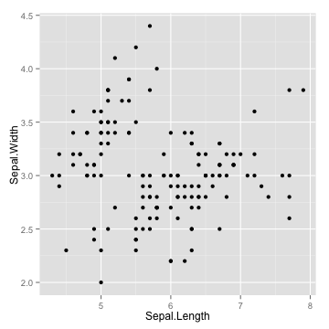

```r
library(ggplot2)
ggplot(data = iris, aes(x = Species, y = Sepal.Length)) + geom_boxplot() + theme_classic()
```


--- ds:noborder

## Why gg?

- `gg` stands for "grammar of graphics"

- Uses a set of terms that defines the basic components of (every) plot

- Produce figures using coherent, consistent syntax (very similar code for very different figures)
  - However, this syntax does vary quite a bit from typical R syntax!
  - If you are a little confused by the syntax at first, that probably just means that you are getting more comfortable with the R language

---

## The grammar

- A basic `ggplot2` plot consists of:
  - `data`: Must be a <b>data frame</b>
  - `aes`(thetics): How your data are represented visually <i>(x, y, color, size, shape, etc.)</i>
  - `geom`(etry): What type of geometric objects you want to display <i>(points, lines, polygons, etc.)</i>

--- ds:noborder

## A basic plot 


```r
library(ggplot2)
ggplot(data = iris, aes(x = Sepal.Length, y = Sepal.Width)) + geom_point()
```


--- ds:noborder .eighty

### Plots can be assembled in pieces 

- Useful for exploring data in different ways

- I'll be using variables from the `state.x77` and `state.region` datasets (US state data from 1977)


```r
state <- data.frame(state.x77, state.region, state.abb)
stateplot <- ggplot(data = state, aes(x = Population, y = Area))
stateplot + geom_point()
```

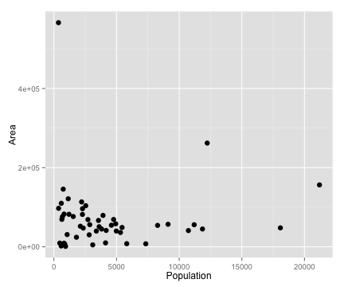

--- ds:noborder

## Aesthetics

Increase the size of points (`size` argument within `geom_point()`)


```r
ggplot(data = state, aes(x = Population, y = Area)) + geom_point(size = 3)
```

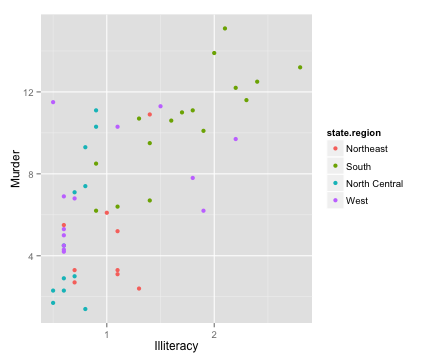

--- ds:noborder

## Aesthetics

- Differentiate state region by <b>color</b> (`color` argument within `aes()`)


```r
ggplot(data = state, aes(x = Illiteracy, y = Murder, color = state.region)) + geom_point(size = 2)
```


--- ds:noborder

## Aesthetics

- Differentiate state region by <b>color</b> and <b>shape</b> (`shape` argument within `aes()`)


```r
ggplot(data = state, aes(x = Life.Exp, y = HS.Grad, color = state.region, shape = state.region)) + geom_point(size = 2)
```


--- ds:soothe ds:noborder

## Try It!

- Take a sample from the `diamonds` dataset


```r
d2 <- diamonds[sample(1:nrow(diamonds), 1000), ]
```

- Then generate this plot:


--- ds:noborder

## Other geometric objects

Type `geom_` and hit tab to see them all. Then, use `?geom_nameofgeom` to see the help screen.

--- ds:noborder

## Other geometric objects
#### Boxplot


```r
ggplot(iris, aes(x = Species,y = Sepal.Length)) + geom_boxplot()
```

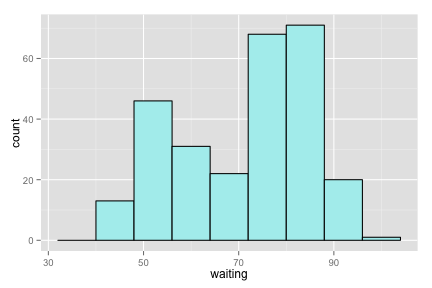

--- ds:noborder

## Other geometric objects
#### Histograms

- Change some of the aesthetics - `binwidth`, `fill`


```r
ggplot(faithful, aes(x = waiting)) + geom_histogram(binwidth = 8, color = "black", fill = "paleturquoise")
```

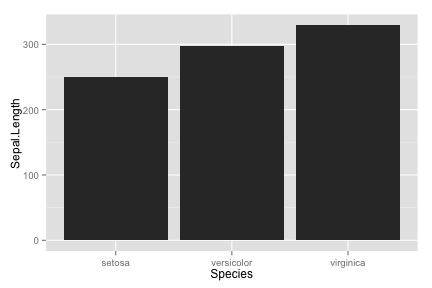

--- ds:noborder

## Other geometric objects
#### Bar plots 


```r
ggplot(iris, aes(x = Species, y = Sepal.Length)) + geom_bar(stat = "identity")
```

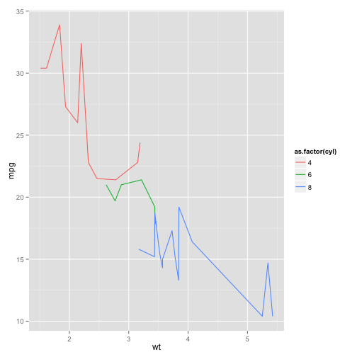

--- ds:noborder

## Other geometric objects
#### Line plots 


```r
ggplot(mtcars, aes(x = wt, y = mpg, color = as.factor(cyl))) + geom_line()
```

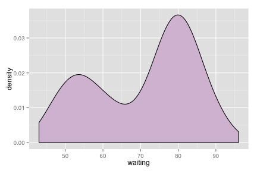

--- ds:noborder

## Other geometric objects
#### Density plots 


```r
ggplot(faithful, aes(waiting)) + geom_density(fill = "thistle")
```

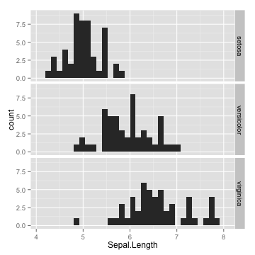

--- ds:soothe  ds:noborder

## Try It!

1. Look up `geom_histogram`. What does it do?

2. Make a histogram of `Sepal.Length` from the `iris` data set. What did it do with the different species?

--- ds:noborder

## Facets

Plots can also have <b>facets</b>, which divide a plot into subplots based on some discrete variable (here, species). Syntax is `facet_grid(Species ~ .)`, where there are as many rows as species and there is only one column (represented by the period).


```r
ggplot(iris, aes(Sepal.Length)) + geom_histogram() + facet_grid(Species ~ .)
```


--- ds:noborder

## Facets

Change to `facet_grid(. ~ Species)` and get one row, three columns.


```r
ggplot(iris, aes(Sepal.Length)) + geom_histogram() + facet_grid(. ~ Species)
```

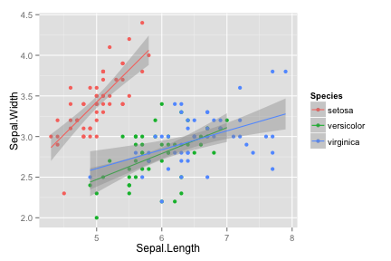

--- ds:noborder

## Stats 

Type `stat_` and hit tab to see them all. Then, use `?stat_nameofstat` to see the help screen.

--- ds:noborder

## Stats 

Use `stat_smooth` to add a linear fit

```r
ggplot(iris, aes(x = Sepal.Length, y = Sepal.Width, color = Species)) + geom_point() + stat_smooth(method = "lm")
```

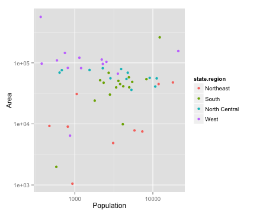

--- ds:noborder

## Scales

- `scales` are used to modify axes and colors 

- For example: 
  - `scale_y_continuous()` Set name, breaks, labels, limits of y-axis 
  - `scale_x_log10()` log transform the x-axis 
  - `scale_colour_manual()` Specify colors for geoms 
  - `scale_fill_discrete()` Specify colors for geoms 

--- ds:noborder

## Scales

- log x and log y axes, `+ scale_x_log10()` and `+ scale_y_log10()`


```r
ggplot(data = state, aes(x = Population, y = Area, color = state.region)) + scale_y_log10() + scale_x_log10() + geom_point()
```


--- ds:noborder

## Scales

- Add color manually using `+ scale_colour_manual()`


```r
ggplot(data = state, aes(x = Population, y = Area, color = state.region)) + scale_y_log10() + scale_x_log10() + geom_point() + scale_colour_manual(values = c("palegreen3","palevioletred3","peachpuff3", "paleturquoise3"))
```


--- ds:noborder

## Labels

- Add labels, including a title and x and y axes labels, using `+ labs()`


```r
ggplot(data = state, aes(x = Life.Exp, y = HS.Grad, color = state.region, shape = state.region)) + geom_point(size = 2) + labs(title = "US States, 1977", x = "Life expectancy (in years)", y = "High school graduation rate (percent)")
```

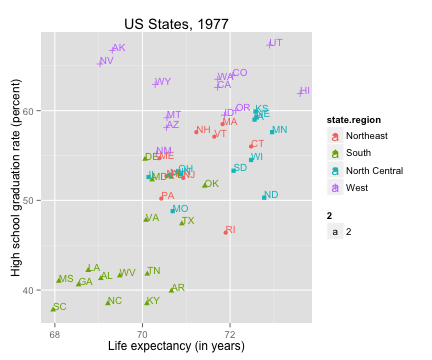

--- ds:noborder

## Labels

- Add labels inside the figure using `+ geom_text()`


```r
ggplot(data = state, aes(x = Life.Exp, y = HS.Grad, color = state.region, shape = state.region)) + geom_point(size = 2) + labs(title = "US States, 1977", x = "Life expectancy (in years)", y = "High school graduation rate (percent)") + geom_text(aes(label = state.abb, size = 2, hjust = 0, vjust = 0))
```


--- ds:noborder .ninety

## Themes 

- Control over the figure as a whole can be done by modifying <b>themes</b>. See `?theme` for all of the options 

- I prefer `+ theme_bw()` (white background with gridlines) or `+ theme_classic()` (white background without gridlines)

- You can also change the overall font family and font size


```r
ggplot(iris, aes(Species, Sepal.Length)) + geom_bar(stat = "identity") + theme_classic(base_family = "Helvetica", base_size = 14)
```


--- ds:noborder

## Saving plots


```r
my_plot <- ggplot(iris, aes(Species, Sepal.Length)) + geom_bar(stat = "identity") + theme_bw()

ggsave("my_plot.jpg", my_plot, height = 4, width = 4, units = "in")
```

You can specify the file name, dimensions, resolution, etc. 

<b>Note:</b> Saved in your current working directory (unless specified).

--- ds:alert  ds:noborder

## R Tip: ggplot2 takes data frames only

<b>Data structure must be a data frame to plot with ggplot2</b>


```r
xvar <- rnorm(100)
yvar <- rnorm(100)
df <- data.frame(xvar, yvar)  # coerce to data frame 
ggplot(df, aes(xvar, yvar)) + geom_point()
```

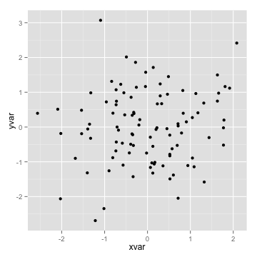

--- ds:soothe

## Try It!

1. Type in `data(package = "datasets")` to see all of the datasets pre-installed with R. 

2. Find some data that interests you (or use your own) and examine its structure. Are they vectors, data frames, other? How many observations are there? 

3. Use `ggplot2` to make a plot of some attribute of the data. 

--- ds:noborder

## Proper data formatting 

- Often our data looks like this ("<b>wide</b>"), where multiple observations can be found in each row


```r
head(df)
```

```
##        spA      spB      spC      spD
## 1 49.10396 68.27981 20.60649 25.39428
## 2 48.64058 74.72528 19.87461 25.42307
## 3 50.51679 74.40623 20.62008 25.50169
## 4 49.02538 77.22343 19.37961 24.08362
## 5 51.44201 67.03794 19.71196 23.91932
## 6 50.83038 74.95657 19.92310 25.78173
```

```r
dim(df)
```

```
## [1] 100   4
```

--- ds:noborder

## Proper data formatting 

- Data is much easier to analyze visually and statisically if it looks like this ("<b>long</b>"), where there is one row per observation


```r
head(df2)
```

```
##   species   weight
## 1       A 76.16731
## 2       B 72.32543
## 3       C 77.33441
## 4       D 76.44599
## 5       A 82.26476
## 6       B 73.12404
```

```r
dim(df2)
```

```
## [1] 400   2
```

--- ds:noborder

### Melting: from wide to long 


```r
# make some fake "wide" data
df <- data.frame(A = rnorm(100, 50, 6), B = rnorm(100, 75, 5), C = rnorm(100, 50, 4), D = rnorm(100, 55, 3))
head(df)
```

```
##          A        B        C        D
## 1 50.73795 71.54831 56.72058 55.50035
## 2 54.38796 76.96641 50.84828 54.08178
## 3 38.34681 75.33919 51.58912 54.43482
## 4 53.64221 75.24042 47.13779 55.63801
## 5 46.89473 70.01894 44.45489 51.73413
## 6 57.43555 68.72379 51.50239 53.52847
```

--- ds:noborder

### Melting: from wide to long 

- Use the `melt()` function in `reshape2` package


```r
library(reshape2)
df2 <- melt(data = df)
```

```
## No id variables; using all as measure variables
```

```r
head(df2)
```

```
##   variable    value
## 1        A 50.73795
## 2        A 54.38796
## 3        A 38.34681
## 4        A 53.64221
## 5        A 46.89473
## 6        A 57.43555
```

```r
dim(df2)
```

```
## [1] 400   2
```

--- ds:noborder

## Melting: from wide to long 

- Melting the data makes it easier to plot


```r
ggplot(df2, aes(x = value)) + geom_histogram() + facet_grid(. ~ variable)
```

```
FALSE `stat_bin()` using `bins = 30`. Pick better value with `binwidth`.
```

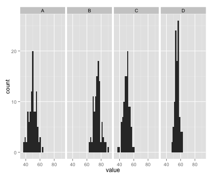

--- ds:noborder

## Helpful links

<a href = "http://docs.ggplot2.org/current/" target = "_blank">ggplot2 documentation</a>

<a href = "http://ggplot2.org/resources/2007-vanderbilt.pdf" target = "_blank">Presentation by Hadley Wickham about ggplot2</a>

<a href = "https://www.rstudio.com/wp-content/uploads/2015/03/ggplot2-cheatsheet.pdf" target = "_blank">ggplot Cheat Sheet</a>

<a href = "http://colorbrewer2.org" target = "_blank">R ColorBrewer</a>

<a href = "http://rpubs.com/mccannecology/47829" target = "_blank">Plotting means and error bars</a>

<a href = "http://www.cookbook-r.com/Graphs/" target = "_blank">R Cookbook: Graphs</a>


---

## Practice


<a href = "https://rpubs.com/mccannecology/53357" target = "_blank">Worksheet</a>

<a href = "https://rpubs.com/mccannecology/53363" target = "_blank">Answers</a>

--- .ninety

## Additional topics and links

- When you get a bit more comfortable with R, I recommend taking a look at the additional material on Mike McCann's website.

<a href = "http://rpubs.com/mccannecology/53465" target = "_blank">Reproducible Research with RMarkdown</a>

<a href = "https://rpubs.com/mccannecology/54011" target = "_blank">Advanced Data Manipulation with dplyr</a>

- I also recommend creating a GitHub account (where I've uploaded this course). GitHub is used for making code freely available as well as for version control (important for collaborating on projects)

<a href = "http://www.github.com" target = "_blank">GitHub</a>

<a href = "http://jonlefcheck.net/2013/11/04/a-basic-tutorial-to-version-control-using-git/" target = "_blank">Basic tutorial on using GitHub (with RStudio)</a>

<a href = "https://try.github.io" target = "_blank">GitHub tutorial (using command line)</a>

##### <a href = "#/1"> Back to the directory </a>

 
